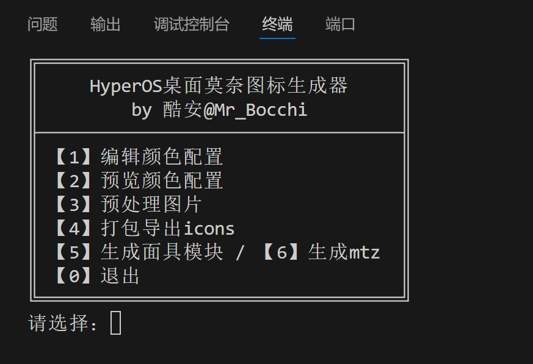
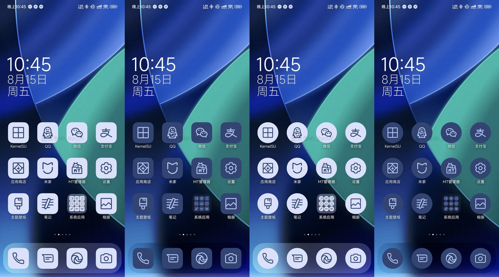

<div align="center">

# HyperOS桌面莫奈图标生成器

简体中文&nbsp;&nbsp;|&nbsp;&nbsp;[English (Trans. by ChatGPT)](/README_en.md)

</div>

## 📖 脚本说明

### 功能实现

- [x] 支持开启 深色模式切换图标样式
- [x] 支持选择 `圆角矩形` 与 `圆形` 图标
- [x] 支持 `日历图标` 显示真实日期
- [x] 支持一键打包 `icons`，并生成 `面具模块` 或 `mtz主题包`

### 功能优化
- [x] 进度条显示处理进度
- [x] 预览颜色配置
- [x] 颜色配置有效性校验、一定程度自动修复
- [x] 使用 `theme_fallback.xml` 优化成品包文件体积
- [x] `name_mapping_by_MrBocchi.json` 修复与补充了一些图标（你也可以自行补充）

### 弊端

`icons` 图标包并不支持动态莫奈取色 `@android:color/system_accent1_*`，所以需要手动获取当前莫奈颜色配置（方法在后文会给出），并且推荐 **每次更换壁纸后需要重新运行一遍项目** 并应用相关文件。

## 🖼️ 预览

### 脚本界面总览



### 成品预览



## 🛠️ 使用说明

### 0. 基础准备

  - 手机端需解锁 Bootloader 并获取 root 权限

  - 脚本运行需 Python 环境，并已安装 Pillow 库

```
pip install Pillow
```

### 1. 获取手机当前 Monet 颜色配置

手机端安装并打开 [Material You Color Previewer](https://github.com/Smooth-E/monet-color-previewer/releases/download/v1.2/Material-You-Color-Previewer-v1.2.apk)。

点击APP主界面 `底栏` 从右往左数第二个 `调色板🎨` 按钮，在出现的 `Copy options` 菜单中选择 `JSON` 选项，并 `Copy` 。

后续使用本项目的 `功能1` 将复制的内容完整粘贴至 `colors.json` 文件内。

### 2. 运行脚本

```
python main.py
```
按照功能名称指示，逐个执行 `功能1~4`。/ `功能5、6` 为可选步骤。

### 3. 图标包的使用

`功能1~4` 执行结束后，根目录会生成 `icons` 文件。

你有三种选择：

1. 【推荐】直接使用

   (1) 这里需要你先应用一个随机主题（不应用主题此方法貌似不会生效）

   (2) 然后使用 [MT管理器](https://mt2.cn/) 将 `icons` 复制至手机的 `/data/system/theme/` 目录

   (3) 赋予 `icons` 完整 **读取权限**（在属性面板中）

   (4) 重启桌面（可以直接使用 MT管理器，在安装包提取界面重启；或者使用 [Hyperceiler](https://github.com/Xposed-Modules-Repo/com.sevtinge.hyperceiler) 一键重启）

2. 使用 `功能5` 打包成面具模块

   (1) 在 `Magisk` 或 `其他root管理器` 中直接刷入。

      - 刷入 `KernelSU` 如果没效果，在 `超级用户` 界面内找到 `系统桌面 com.miui.home` 的 `App Profile` 内，（**不用** 授权超级用户权限），在下方切换成 `自定义`，并且关闭 `卸载模块`。重启桌面。

   (2) 刷入后重启手机。

3. 使用 `功能6` 打包成 mtz 主题包

   使用主题破解模块，导入并应用主题。

## 🧩 工作原理

HyperOS 的图标包本质是一个无后缀名、名为 `icons` 的压缩文件。

- 默认的 `icons` 位于 `/system/media/theme/default/` 目录下
- 当前在使用的主题的 `icons` 存放于 `/data/system/theme/` 目录下
- mtz 主题包内，`icons` 存放于 mtz 根目录

### 1. `自动切换深色模式` 功能原理

`自动切换深色模式` 功能，即：跟随系统深色/浅色模式自动切换深浅图标。

文件目录结构：
```
icons/
  ├─ transform_config.xml
  └─ fancy_icons/
      ├─ com.tencent.mm/
      │   ├─ iconBg_0.png
      │   ├─ iconBg_1.png
      │   └─ manifest.xml   // 用于提供图标切换功能
      ├─ com.coolapk.market/
      │   ├─ iconBg_0.png
      │   ├─ iconBg_1.png
      │   └─ manifest.xml
      └─ ...
```
方案由 [酷安@阿尼亚超爱吃花生](http://www.coolapk.com/u/10895092) 收集，我在此基础上整合成一键打包脚本。

### 2. `theme_fallback.xml` 原理

为了优化最终 `icons` 图标包的文件体积，在关闭 `自动切换深色模式` 功能情况下¹，本项目使用了 `theme_fallback.xml` 映射图标文件。多个应用使用相同图标时，仅需存放一份图标文件。

此时的文件目录结构：
```
icons/
  ├─ theme_fallback.xml
  ├─ transform_config.xml
  └─ res/
      └─ drawable-xxhdpi/
            ├─ wechat.png
            ├─ coolapk.png
            └─ ...
```

图片的实际名称即为 Lawnicons 项目中图标的原始文件名。

`theme_fallback.xml` 文件内部结构：
```
<?xml version='1.0' encoding='utf-8' standalone='yes'?>
<MIUI_Theme_Values>
  <drawable name="com.tencent.mm.png">wechat.png</drawable>
  <drawable name="com.coolapk.market.png">coolapk.png</drawable>
  <drawable name="com.example.c001apk.png">coolapk.png</drawable>
  ...
</MIUI_Theme_Values>
```

注¹：开启 `自动切换深色模式` 功能时，没法使用 `theme_fallback.xml`。

### 3. 图标 Monet 取色原理

在 Android 12+ 系统中，`@android:color/` 下提供了一整套 `system_accent*` 与 `system_neutral*` 动态取色资源，系统会根据壁纸自动生成并切换。

可惜的是，小米主题并不支持动态读取这一系列值。所以我采用了先 **手动读取该系列资源值**，然后 **生成成品图标**，再 **打包使用** 的逻辑。

本项目在绘制图标前景与背景时，使用了其中的 `accent1` 系列：

- 浅色模式：前景 `accent1_700`，背景 `accent1_100`
- 深色模式：前景 `accent1_200`，背景 `accent1_700`

### 4. 如何同步 `Lawnicons` 的更新

解释一下 `appfilter_plain.xml` 与 `drawable.zip` 的制作方法。

如果我停更了，你也可以自己同步 `Lawnicons` 的新图标。

1. 前往 [Lawnicons 发行版](https://github.com/LawnchairLauncher/lawnicons/releases) 下载最新的 apk 安装包，并在 [MT管理器](https://mt2.cn/download/) 中打开。

2. 反编译 `/res/xml/appfilter.xml` → `appfilter_plain.xml`

   **具体方法**：定位到 `/res/xml/appfilter.xml` → `反编译` 方式打开文件 → 右上角三个点 `⋮` → `文件` → `导出为纯文本` → 保存为 `appfilter_plain.xml`

   **❌️错误方法**：采用复制 `appfilter.xml` 内容的方法，会超出剪切板限制，可能导致文件内容不完整。

3. 提取 `/res/drawable/` 目录下所有 `*_foreground.xml`。
   
   **具体方法**：定位到 `/res`，解压整个 `drawable` 文件夹到任意目录 `A`；在目录 `A` 中搜索 `_foreground.xml`，在搜索结果弹窗中，点击左下角的按钮 `↕`，在打开的界面中全选，移动到新的目录 `B`；删除目录 `A`。

4. 批量重命名 `_foreground.xml` → `.xml`。

5. 批量 XML 转换 PNG：下载 [Apktool M](https://maximoff.su/apktool/?lang=en)。在该应用的侧边栏，定位到刚才的目录 `B` 内，`全选`，`转换为PNG`，尺寸输入 `215`。再回到 MT管理器 ，搜索 `.png`，全部移动到新建的名为 `drawable` 的文件夹中。
   
   ⚠ 再说一遍，转换 PNG 时尺寸必须为 `215`，这很重要！

6. 最后压缩这个 `drawable` 文件夹，得到 `drawable.zip`。

   ⚠ 注意压缩的是这个文件夹，不是里面的文件。压缩包内部需要有一层 `drawable` 目录，然后里面是 png 素材。

## 💖 特别感谢

[Lawnicons 项目主页](https://github.com/LawnchairLauncher/lawnicons)

[Material You Color Previewer 项目主页](https://github.com/Smooth-E/monet-color-previewer)
