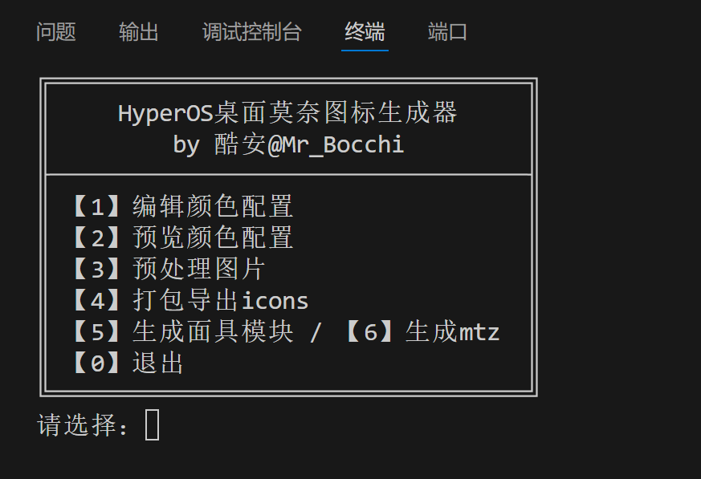

<div align="center">

# HyperOS Monet Icon Generator for Launcher

[简体中文](/README.md)&nbsp;&nbsp;|&nbsp;&nbsp;English (Trans. by ChatGPT)

</div>

## 📖 Script Description

### Features

- [x] Support dark mode toggle for icon styles
- [x] Support `rounded rectangle` and `circle` icon shapes
- [x] Support `calendar icons` displaying the real date
- [x] Support one-click packaging of `icons`, generating either a `Magisk Module` or `mtz theme package`

### Optimizations
- [x] Progress bar to show processing status
- [x] Preview color configuration
- [x] Color configuration validation and partial auto-repair
- [x] Use of `theme_fallback.xml` to optimize package size
- [x] `name_mapping_by_MrBocchi.json` fixes and adds some missing icons (you can add your own as well)

### Limitations

The `icons` package does not support dynamic Monet extraction `@android:color/system_accent1_*`.  
You need to manually obtain the current Monet color configuration (method provided later).  
It is recommended to **re-run the script each time you change the wallpaper** and reapply the generated files.

## 🖼️ Preview

### Script Interface Overview



### Final Result Preview


## 🛠️ Usage Guide

### 0. Prerequisites

  - Phone must have an unlocked Bootloader and root access

  - Script requires Python environment with Pillow installed

```
pip install Pillow
```

### 1. Obtain Current Monet Color Configuration

Install [Material You Color Previewer](https://github.com/Smooth-E/monet-color-previewer/releases/download/v1.2/Material-You-Color-Previewer-v1.2.apk) on your phone.

In the app’s main screen, tap the `palette 🎨` button (second from the right in the bottom bar).  
From the `Copy options` menu, select `JSON` and then `Copy`.

Later, for `Feature 1` in this project, paste the copied JSON into the `colors.json` file.

### 2. Run the Script

```
python main.py
```
Follow the function names, execute `Feature 1~4` step by step.  
`Feature 5 & 6` are optional.

### 3. Using the Icon Package

After completing `Feature 1~4`, the `icons` folder will be generated in the root directory.

You have three options:

1. **[Recommended] Direct Usage**

   (1) First apply any random theme (required for changes to take effect)

   (2) Use [MT Manager](https://mt2.cn/) to copy `icons` into `/data/system/theme/` on your phone

   (3) Grant **full read permissions** to `icons` (via properties panel)

   (4) Restart the launcher (can be done directly via MT Manager in the package extractor, or use [Hyperceiler](https://github.com/Xposed-Modules-Repo/com.sevtinge.hyperceiler) to restart in one tap)

2. Package as Magisk Module (`Feature 5`)

   (1) Flash directly in `Magisk` or `other root managers`.

      - If flashing with `KernelSU` doesn’t work, go to the `Superuser` interface, find `System Launcher com.miui.home` in the `App Profile` section (do **not** grant superuser permission), switch to `Custom` below, and disable `Uninstall Module`. Then restart the launcher.

   (2) After flashing, reboot the phone.

3. Package as `mtz` Theme (`Feature 6`)

   Use a theme patching module, import the theme, and apply it.

## 🧩 How It Works

HyperOS icon packs are essentially compressed files named `icons` without an extension.

- Default `icons` is located in `/system/media/theme/default/`
- Currently applied theme’s `icons` is located in `/data/system/theme/`
- Inside `mtz` themes, `icons` is in the root directory

### 1. Principle of `Auto Dark Mode Switching`

This feature lets icons automatically switch between dark/light mode with the system theme.

Directory structure:
```
icons/
  ├─ transform_config.xml
  └─ fancy_icons/
      ├─ com.tencent.mm/
      │   ├─ iconBg_0.png
      │   ├─ iconBg_1.png
      │   └─ manifest.xml   // 用于提供图标切换功能
      ├─ com.coolapk.market/
      │   ├─ iconBg_0.png
      │   ├─ iconBg_1.png
      │   └─ manifest.xml
      └─ ...
```
Solution inspired by [Coolapk @阿尼亚超爱吃花生](http://www.coolapk.com/u/10895092), further integrated here into a one-click packaging script.

### 2. Principle of `theme_fallback.xml`

To optimize the final `icons` package size, when `Auto Dark Mode Switching` is **disabled**, the project uses `theme_fallback.xml` for icon mapping.  
When multiple apps share the same icon, only one copy of the file is stored.

Directory structure in this mode:
```
icons/
  ├─ theme_fallback.xml
  ├─ transform_config.xml
  └─ res/
      └─ drawable-xxhdpi/
            ├─ wechat.png
            ├─ coolapk.png
            └─ ...
```

The actual filenames are the original icon names from the Lawnicons project.

`theme_fallback.xml` structure:
```
<?xml version='1.0' encoding='utf-8' standalone='yes'?>

\<MIUI_Theme_Values> <drawable name="com.tencent.mm.png">wechat.png</drawable> <drawable name="com.coolapk.market.png">coolapk.png</drawable> <drawable name="com.example.c001apk.png">coolapk.png</drawable>
...
\</MIUI_Theme_Values>
```

Note¹: `theme_fallback.xml` cannot be used when `Auto Dark Mode Switching` is enabled.

### 3. Icon Monet Coloring Principle

In Android 12+, a full set of dynamic coloring resources `system_accent*` and `system_neutral*` are provided under `@android:color/`. The system automatically generates and switches these values based on the wallpaper.

Unfortunately, MIUI themes do not support reading these values dynamically. Therefore, the final approach is to **manually extract the resource values**, then **generate the finished icons**, and finally **package them for use**.

When drawing icon foregrounds and backgrounds, this project uses the `accent1` series:

- Light mode: Foreground `accent1_700`, Background `accent1_100`  
- Dark mode: Foreground `accent1_200`, Background `accent1_700`

### 4. How to Sync Lawnicons Updates

Explanation of how to create `appfilter_plain.xml` and `drawable.zip`.

If I stop maintaining this project, you can still update icons yourself.

1. Download the latest Lawnicons APK from [Lawnicons Releases](https://github.com/LawnchairLauncher/lawnicons/releases), open it in [MT Manager](https://mt2.cn/download/).

2. Decompile `/res/xml/appfilter.xml` → save as `appfilter_plain.xml`

   **Correct method**: Open `/res/xml/appfilter.xml` with `Decompile`, then tap top-right `⋮` → `File` → `Export as plain text` → save as `appfilter_plain.xml`

   **❌ Wrong method**: Copy-pasting directly may exceed clipboard limits, leading to incomplete files.

3. Extract all `*_foreground.xml` from `/res/drawable/`.

   **Steps**: Locate `/res`, extract the whole `drawable` folder into directory `A`; search for `_foreground.xml` in `A`; from results, tap `↕`, select all, move to directory `B`; delete `A`.

4. Batch rename `_foreground.xml` → `.xml`.

5. Batch convert XML to PNG:  
   Install [Apktool M](https://maximoff.su/apktool/?lang=en).  
   In the sidebar, go to directory `B`, `Select all`, `Convert to PNG`, enter size `215`.  
   Return to MT Manager, search `.png`, move all into a folder named `drawable`.

   ⚠ Important: PNG size must be exactly `215`!

6. Compress the `drawable` folder into `drawable.zip`.

   ⚠ Ensure you compress the folder itself, not just the files. Inside the zip, there must be a `drawable` folder containing the PNGs.

## 💖 Special Thanks

[Lawnicons Project Homepage](https://github.com/LawnchairLauncher/lawnicons)

[Material You Color Previewer Project Homepage](https://github.com/Smooth-E/monet-color-previewer)
